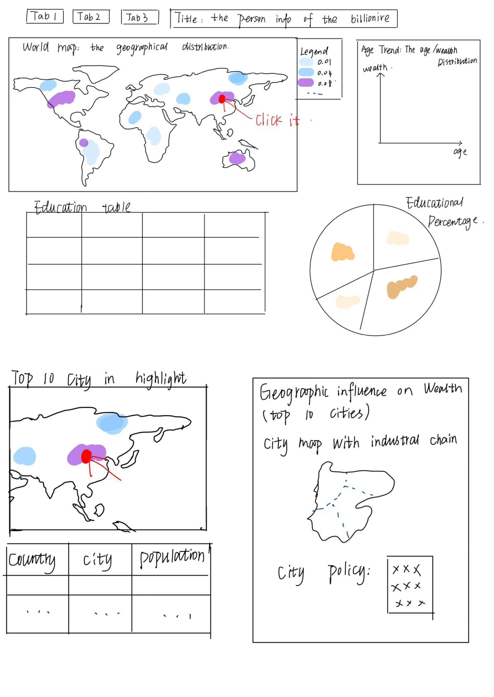

# Billionaires Data Visualization Dashboard

## Overview
This project aims to develop an interactive data visualization dashboard that provides insights into self-made billionaires. The dashboard will enable users to explore billionaire distribution across different countries, industry trends, and the influence of age and education on wealth accumulation.

## Project Goals
1. **Global Distribution Analysis**:
   - Visualize the worldwide geographical distribution of billionaires.
   - Identify wealth hotspots and clusters.

2. **Top 10 Cities Analysis**:
   - Select the top 10 cities with the highest number of billionaires.
   - Analyze the basic demographics and economic characteristics of these cities.

3. **Industry and Economic Correlation**:
   - Examine the key industries in each top city.
   - Compare billionaire industries with dominant city industries.
   - Evaluate the influence of city policies on billionaire wealth generation.

## Methodology
1. **Data Collection**:
   - Gather billionaire-related data (location, industry, net worth, etc.).
   - Collect economic and policy data for major cities.

2. **EDA (Exploratory Data Analysis)**:
   - Create visualizations for wealth distribution across countries and cities.
   - Use statistical summaries to describe key patterns.

3. **Comparative Analysis**:
   - Compare the industrial landscape of billionaire cities with their key economic sectors.
   - Assess correlations between billionaire industries and city policies.
     
## Interaction Design
1. **Dropdown Filters**: Users can filter billionaires by country, industry, and year.
2. **Hover & Click Features**: Detailed data appears when users hover over visual elements.
3. **Time-Series Animation**: Users can track wealth accumulation over time.

## Expected Outcomes
- Clear insights into how billionaires are distributed globally.
- Understanding of the economic and industrial factors influencing billionaire hotspots.
- Policy recommendations for fostering economic growth and innovation in major wealth centers.

## How to Use This Repository
- The dataset and visualizations will be available in structured formats.
- Notebooks and reports will be provided for in-depth analysis.
- Contributions and discussions are encouraged to refine insights.

## Contributors
- Mingyue Zhao
- Wenjun Cheng
- Jieyi Yao

For any questions or collaborations, feel free to reach out!

